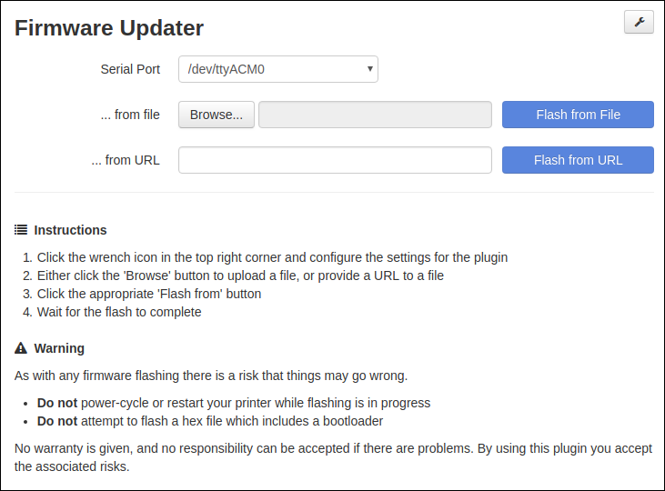
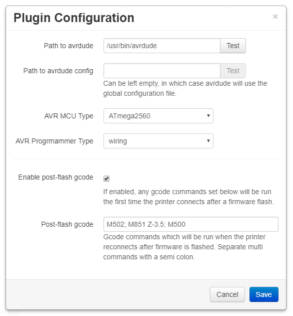

# OctoPrint Firmware Updater

This plugin can be used to flash the firmware of your printer by selecting a file or an URL.



Currently supported and tested MCUs are Atmega1284p and Atmega2560.

## Setup

Install via the bundled [Plugin Manager](https://github.com/foosel/OctoPrint/wiki/Plugin:-Plugin-Manager)
or manually using this URL:

    https://github.com/OctoPrint/OctoPrint-FirmwareUpdater/archive/master.zip

### AVRDUDE setup

AVRDUDE needs to be installed on the server where OctoPrint is running.

#### Raspberry Pi

```
sudo apt-get update
sudo apt-get install avrdude
```

#### Ubuntu (12.04 - 14.04 - 15.04)

Information about the package needed can be found here [Ubuntu avrdude package](https://launchpad.net/ubuntu/+source/avrdude)

```
sudo add-apt-repository ppa:pmjdebruijn/avrdude-release
sudo apt-get update
sudo apt-get install avrdude
```

## Configuration

In order to be able to flash firmware we need to specify the path to avrdude, and some parameters it will need.



The minimum settings are:
* Path to avrdude
* AVR MCU Type
* AVR Programmer Type

Typical MCU/programmer combinations are:

| AVR MCU | Programmer |
| --- | --- |
| Atmega1284p | arduino |
| Atmega2560 | wiring |
