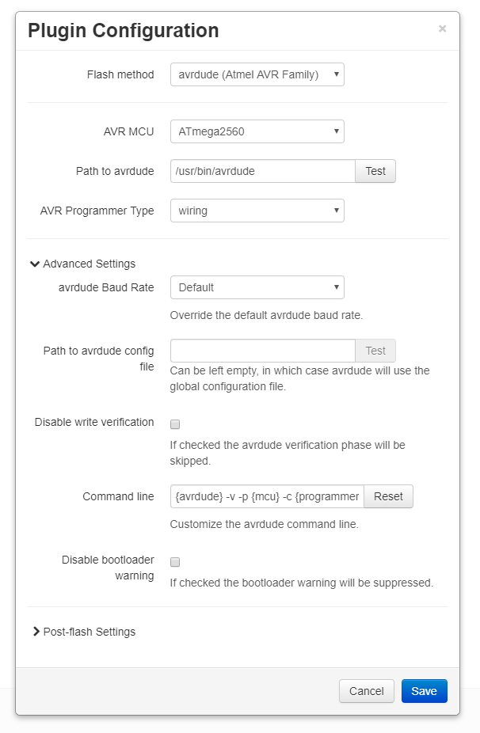
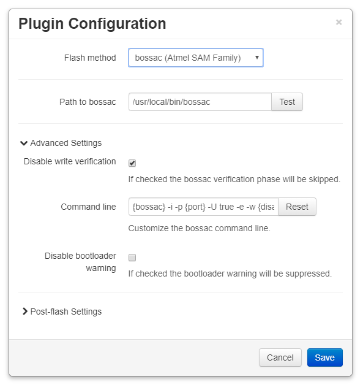
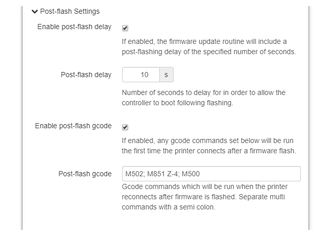

# OctoPrint Firmware Updater

This plugin can be used to flash pre-compiled firmware images to your printer from a file or URL.

<p align="center"></p>

Works with boards with Atmel AVR family 8-bit MCUs (Atmega1280, Atmega1284p, and Atmega2560) MCUs, and Atmel SAM family 32-bit MCUs (Arduino DUE).

## Setup

Install via the bundled [Plugin Manager](https://github.com/foosel/OctoPrint/wiki/Plugin:-Plugin-Manager)
or manually using this URL:

    https://github.com/OctoPrint/OctoPrint-FirmwareUpdater/archive/master.zip

The appropriate flashing tool also needs to be installed.  For 8-bit MCUs the tools is **avrdude**, for 32-bit MCUs the tool is **bossac**.

### AVRDUDE Installation

AVRDUDE needs to be installed on the server where OctoPrint is running.

#### Raspberry Pi

```
sudo apt-get update
sudo apt-get install avrdude
```

#### Ubuntu (12.04 - 14.04 - 15.04)

Information about the package needed can be found here [Ubuntu avrdude package](https://launchpad.net/ubuntu/+source/avrdude)

```
sudo add-apt-repository ppa:pmjdebruijn/avrdude-release
sudo apt-get update
sudo apt-get install avrdude
```

### BOSSAC Installation
Bossac cannot be installed using a package manager as the packaged version is out of date and will not work.  Installation from source is straight-forward.

#### Raspberry Pi / Ubuntu

```
cd ~/
sudo apt-get install libwxgtk3.0-dev libreadline-dev
wget https://github.com/shumatech/BOSSA/archive/1.7.0.zip
unzip 1.7.0.zip
cd BOSSA-1.7.0
./arduino/make_package.sh
sudo cp ~/BOSSA-1.7.0/bin/bossac /usr/local/bin/
```

## Configuration

In order to be able to flash firmware we need to select and configure a flash method.  Once the flash method is selected additional options will be available.

### AVRDUDE Configuration
<p align="center"></p>

The minimum settings are:
* Path to avrdude
* AVR MCU Type
* AVR Programmer Type

Typical MCU/programmer combinations are:

| AVR MCU | Programmer | Example Board |
| --- | --- | --- |
| Atmega1284p | arduino | Anet A series |
| Atmega2560 | wiring | RAMPS, RAMbo, etc. |
| Atmega644p | arduino | Sanguinololu, Melzi |

### BOSSAC Configuration
<p align="center"></p>
The only required setting is the path to the bossac binary.

### Customizing the Command Lines
The command lines for avrdude and bossac can be customized by editing the string in the advance settings for the flash method.  Text in braces (`{}`) will be substituted for preconfigured values if present.

| String | Description|
| --- | --- |
| `{avrdude}` | Full path to the avrdude executable<sup>1</sup> |
| `{bossac}` | Full path to the bossac executable<sup>2</sup> |
| `{mcu}` | Avrdude MCU type<sup>1</sup> |
| `{programmer}` | Avrdude programmer<sup>1</sup> |
| `{port}` | COM port the printer is connected to |
| `{conffile}` | Full path to the avrdude configuration file<sup>1</sup> |
| `{baudrate}` | Serial port speed<sup>1</sup> |
| `{disableverify}` | Switch to disable write verification |
| `{firmware}` | Path to the uploaded firmware file |

1. Avrdude flash method only
2. Bossac dude flash method only

#### Command Line Defaults
Command lines can be returned to the default by clicking the **Reset** button.

##### Avrdude
`{avrdude} -v -q -p {mcu} -c {programmer} -P {port} -D -C {conffile} -b {baudrate} {disableverify} -U flash:w:{firmware}:i`

##### Bossac
`{bossac} -i -p {port} -U true -e -w {disableverify} -b {firmware} -R`

### Post-flash Settings
<p align="center"></p>

#### Post-flash Delay ####
This setting can be used to insert a delay of up to 180s after the firmware has been uploaded, before OctoPrint will try to reconnect to the printer.  This can be useful if the board takes some time to restart.  A delay of 20-30s is usually enough.

#### Post-flash Gcode ####
You can use the post-flash gcode settings to run gcode commands after a successful firmware flash.
The post-flash code will run more or less immediately if the printer was connected before the flash started (so reconnects automatically when the flash finishes), or whenever the printer is manually reconnected after the firmware is flashed.

## Flashing
Once the plugin is configured, flashing firmware is a simple operation:
1. Select the COM port to communicate with the board
1. Select a firmware file, either located on the filesystem or via a URL
1. Click the appropriate **Flash from** button
1. Wait for the firmware update to complete

## Troubleshooting
Log messages can be found in the OctoPrint log `octoprint.log` and the Firmware Updater's console log `plugin_firmwareupdater_console.log`.  

Both log files can be downloaded from OctoPrint's logging interface, found under 'Logging' in the settings page.

If you have trouble using the plugin please check these logs for any error messages.  If you need help, please include both logs when reporting a problem.
