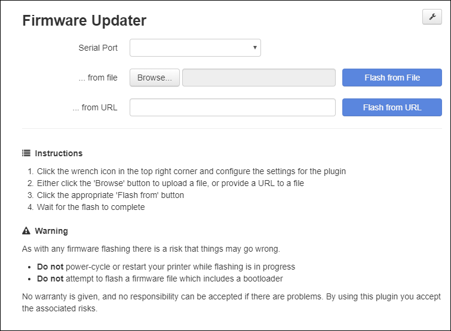

# OctoPrint Firmware Updater
The Firmware Updater plugin can be used to flash pre-compiled firmware images to your printer from a local file or URL.



## Documentation Index
1. [Supported Boards](#supported-boards)
1. [Plugin Installation](#plugin-installation)
1. [Plugin Configuration](#plugin-configuration)
1. Board-Specific Configuration
   1. [ATmega Boards](#atmega-boards)
      1. [Avrdude Installation](#avrdude-installation)
      1. [Avrdude Configuration](#avrdude-configuration)
   1. [AT90USB Boards](#at90usb-boards)
      1. [Dfu-programmer Installation](#dfu-programmer-installation)
      1. [Dfu-programmer Configuration](#dfu-programmer-configuration)
   1. [LPC1768 Boards](#lpc1768-boards)
      1. [Usbmount Installation](#usbmount-installation)
   1. [SAM Boards](#sam-boards)
      1. [Bossac Installation](#bossac-installation)
      1. [Bossac Configuration](#bossac-configuration)
   1. [STM32 Boards](#stm32-boards)
      1. [STM32Flash Installation](#stm32flash-installation)
      1. [STM32Flash Configuration](#stm32flash-configuration)
1. [Customizing the Command Lines](#customizing-the-command-lines)
1. [Pre and Post Flash Settings](#pre-and-post-flash-settings)
1. [Flashing](#flashing)
1. [Troubleshooting](#troubleshooting)
1. [Donations](#donations)

## Supported Boards
The plugin supports a variety of boards, based on the MCU (processor) they have:
* 'ATmega' family 8-bit MCUs (RAMPS, Sanguinololu, Melzi, Anet, Creality, Ender, many others)
* 'AT90USB' family 8-bit MCUs (Printrboard)
* 'LPC1768' MCUs (MKS SBASE, SKR v1.1 and v1.3, etc., also SKR Pro v1.1)
* 'SAM' family 32-bit MCUs (Arduino DUE, etc.)
* 'STM32' family 32-bits MCUs with embedded ST serial bootloader (FYSETC Cheetah, **not** SKR Pro)

### Not-yet Supported Boards
* SKR Mini E3 - waiting on more information, see [this issue](https://github.com/OctoPrint/OctoPrint-FirmwareUpdater/issues/103)

#### Special Note for the SKR Pro v1.1 STM32 Board
It seems that SKR have included a custom bootloader which enables their STM32-based SKR Pro v1.1 to be flashed using the same copy-and-reset procedure as their LPC1768-based boards.  **Please follow the LPC1768 instructions for an SKR Pro v1.1 board.**

Please open a [Github issue](https://github.com/OctoPrint/OctoPrint-FirmwareUpdater/issues) if you would like a new board or MCU to be supported. If it's a new type of board which requires hardware testing please consider making a [donation](#Donations) to help fund the costs.

## Plugin Installation
Install via the bundled [Plugin Manager](https://github.com/foosel/OctoPrint/wiki/Plugin:-Plugin-Manager)
or manually using this URL:
    https://github.com/OctoPrint/OctoPrint-FirmwareUpdater/archive/master.zip

## Plugin Configuration
The appropriate flashing tool for the board type needs to be selected. 

| Board Family | Flashing Tool  |
| -----------: | :------------- | 
| ATmega       | avrdude        |
| AT90USB      | dfu-programmer |
| LPC1768      | lpc1768        |
| SAM          | bossac         |
| STM32        | stm32flash     |

#### Special Note for the SKR Pro v1.1 STM32 Board
It seems that SKR have included a custom bootloader which enables their STM32-based SKR Pro v1.1 to be flashed using the same copy-and-reset procedure as their LPC1768-based boards.  **Please follow the LPC1768 instructions for an SKR Pro v1.1 board.**

Plugin settings vary depending on the flashing tool and are documented below.

## Board-Specific Configuration

### ATmega Boards
To flash an ATmega-based board the tool `avrdude` needs to be installed on the OctoPrint host.

#### Avrdude Installation
##### Raspberry Pi

```
sudo apt-get update
sudo apt-get install avrdude
```

##### Ubuntu (12.04 - 14.04 - 15.04)
Information about the package needed can be found here [Ubuntu avrdude package](https://launchpad.net/ubuntu/+source/avrdude)

```
sudo add-apt-repository ppa:pmjdebruijn/avrdude-release
sudo apt-get update
sudo apt-get install avrdude
```

#### Avrdude Configuration
The minimum settings are:
* AVR MCU Type
* Path to avrdude
* AVR Programmer Type

Typical MCU/programmer combinations are:

| AVR MCU | Programmer | Example Board |
| --- | --- | --- |
| Atmega1284p | arduino | Anet A series, Creality, Ender, etc. |
| Atmega2560 | wiring | RAMPS, RAMbo, etc. |
| Atmega644p | arduino | Sanguinololu, Melzi |

Optional advanced settings are available for:
* Baud rate - sets the speed for communication with the board
* Avrdude config file - overrides the default config file with a custom one
* Disabling write verification - speeds up flashing by not verifying the write operation
* Customizing the avrdude command line
* Disabling the bootloader warning - disables a warning which is shown the hex filename has 'bootloader' in it

### AT90USB Boards
To flash an AT90USB-based board the tool `dfu-programmer` needs to be installed on the OctoPrint host. 

#### Dfu-programmer Installation
A version of `dfu-programmer` can be installed via `apt-get install` but it is outdated.  Please build the latest version from [Github](https://github.com/dfu-programmer/dfu-programmer) using these commands:

```
cd ~
sudo apt-get install autoconf libusb-1.0-0-dev
git clone https://github.com/dfu-programmer/dfu-programmer.git
cd dfu-programmer
./bootstrap.sh
./configure 
make
sudo make install
```
If there were no errors `dfu-programmer` should now be installed at /usr/local/bin/dfu-programmer.

#### Dfu-programmer Configuration
The minimum settings are:
* AVR MCU Type
* Path to dfu-programmer

Optional advanced settings are available for:
* Customizing the command lines for erasing and flashing the board

#### DFU Mode
AT90USB boards must be in **Boot** or **DFU** mode before they can be flashed.  This is done by placing or removing a jumper then resetting the board.

For Printrboard:
* Remove the BOOT jumper (for Rev D, E & F boards, install the BOOT jumper)
* Press and release the **Reset** button.
* Replace the BOOT jumper onto the board (for Rev D, E & F boards, remove the BOOT jumper)

The board will now be ready for flashing. Once flashing is complete press the **Reset** button again to return to normal operation.

### LPC1768 Boards
Flashing an LPC1768 board requires that the host can mount the board's on-board SD card to a known mount point in the host filesystem.  

There are several ways to do this, but using [usbmount](https://github.com/rbrito/usbmount) works well and is documented below. It will mount the SD card to `/media/usb`.

**Note:** The Marlin board configuration must have `SDCARD_CONNECTION ONBOARD` (previously `USB_SD_ONBOARD`) enabled so that the on-board SD card is presented to the host via the USB connection.  This seems to be the default configuration for Marlin's LPC1768 boards.  It is configured in the board's pins file.

Once installed, usbmount requires some tweaking to make it work well on the Raspberry Pi.  The instructions below assume that you are running OctoPrint on a Raspberry Pi, as the user 'pi'.

#### Usbmount Installation
1. Install usbmount

   `sudo apt-get install usbmount`

2. Configure usbmount so that the mount has the correct permissions for the 'pi' user

   `sudo nano /etc/usbmount/usbmount.conf`
   
   Find FS_MOUNTOPTIONS and change it to:
   
   `FS_MOUNTOPTIONS="-fstype=vfat,gid=pi,uid=pi,dmask=0022,fmask=0111"`
   
3. Configure systemd-udevd so that the mount is accessible

   `sudo systemctl edit systemd-udevd`
   
   Insert these lines then save and close the file:
   ```
   [Service]
   MountFlags=shared
   ```

   Then run:
   ```
   sudo systemctl daemon-reload
   sudo service systemd-udevd --full-restart
   ```

Once usbmount is installed and configured the LPC1768 on-board SD card should be mounted at `/media/usb` the next time it is plugged in or restarted.

#### LPC1768 Configuration
The only required setting is the path to the firmware update folder.  If using usbmount it will probably be `/media/usb`.

Optional advanced settings are available for:
* Resetting the board prior to flashing - adds an extra board reset which can help ensure that the SD card is mounted correctly

##### Minimum Marlin Firmware Version
Some boards (e.g. SKR v1.3) have been known to ship with older Marlin firmware which does not support the `M997` command, so must be updated conventionally one time before using the plugin. A board running too-old Marlin firmware will log 'Board reset failed' when attempting to flash from the plugin.

If flashing an existing Marlin installation, the existing firmware must be newer than March 2nd, 2019 (i.e [this commit](https://github.com/MarlinFirmware/Marlin/pull/13281)) as that is when the `M997` was added to support resetting the board.

##### Troubleshooting LPC1768 Uploads
The firmware upload will fail if the SD card is not accessible, either because it is not mounted on the host, or because the printer firmware has control over it.  

### SAM Boards
To flash a SAM-based board the tool `bossac` needs to be installed on the OctoPrint host.

#### Bossac Installation
Bossac cannot be installed using a package manager as the packaged version is out of date and will not work.  Installation from source is straight-forward.

```
cd ~/
sudo apt-get install libwxgtk3.0-dev libreadline-dev
wget https://github.com/shumatech/BOSSA/archive/1.7.0.zip
unzip 1.7.0.zip
cd BOSSA-1.7.0
./arduino/make_package.sh
sudo cp ~/BOSSA-1.7.0/bin/bossac /usr/local/bin/
```

#### Bossac Configuration
The only required setting is the path to the bossac binary.

Optional advanced settings are available for:
* Disabling write verification - speeds up flashing by not verifying the write operation
* Customizing the bossac command line

### STM32 Boards
To flash an STM32-based board the tool `stm32flash` needs to be installed on the OctoPrint host.

#### STM32Flash Installation
##### Install on Linux/RaspberryPi using apt-get

```
sudo apt-get update
sudo apt-get install stm32flash
```

##### Install on macOS using brew
```
brew install stm32flash
```

##### Install on Windows
You can install a Windows binary from https://sourceforge.net/projects/stm32flash/ however the plugin hasn't been tested on that platform.

#### STM32Flash Configuration
##### Firmware verification
Unlike avrdude, verification is done during write process after each packet. Writing process is longer than other flashing methods, but there is no verification after the write. It is strongly recommended to keep it enabled.

##### BOOT0/Reset pins
When using ST serial bootloader, the boards needs to enter into bootloader mode by setting up the MCU BOOT0 input to HIGH and then proceeding with a MCU RESET input to LOW. 

Such MCU inputs are generally connected to RTS/DTR signals of the USB-UART transceiver.  For example, FYSETC Cheetah uses RTS to set BOOT0, and DTR to reset.

Please set STM32Flash BOOT0/Reset according to your board.

##### Execution address
Unlike other MCU, STM32 ones will remain in bootloader mode after resetting DTR line and realeasing UART. The bootloader needs an explicit command to jump at a given flash address.

Please setup Execution address according to your board.

##### Reset
When setting Execution address, reset option is ignored by stm32flash. Setting Reset instead of Execution address will actually send an `Execute @ 0x00000000`, which is where the bootloader is located. You will then need to power cycle your board to execute firmware. This option is not recommended then. 

## Customizing the Command Lines
The command lines for `avrdude`, `bossac`, and `dfu-programmer` can be customized by editing the string in the advanced settings for the flash method.  Text in braces (`{}`) will be substituted for preconfigured values if present.

| String | Description|
| --- | --- |
| `{avrdude}` | Full path to the `avrdude` executable<sup>1</sup> |
| `{bossac}` | Full path to the `bossac` executable<sup>2</sup> |
| `{dfuprogrammer}` | Full path to the `dfu-programmer` executable<sup>3</sup> |
| `{mcu}` | MCU type<sup>4</sup> |
| `{programmer}` | Avrdude programmer<sup>1</sup> |
| `{port}` | COM port the printer is connected to |
| `{conffile}` | Full path to the avrdude configuration file<sup>1</sup> |
| `{baudrate}` | Serial port speed<sup>1</sup> |
| `{disableverify}` | Switch to disable write verification |
| `{firmware}` | Path to the uploaded firmware file |

1. avrdude flash method only
2. bossac flash method only
3. dfu-programmer flash method only
4. avrdude and dfu-programmer flash methods

#### Command Line Defaults
Command lines can be returned to the default by clicking the **Reset** button.

##### Avrdude
`{avrdude} -v -q -p {mcu} -c {programmer} -P {port} -D -C {conffile} -b {baudrate} {disableverify} -U flash:w:{firmware}:i`

##### Bossac
`{bossac} -i -p {port} -U true -e -w {disableverify} -b {firmware} -R`

##### Dfu-programmer
Erase: `{bossac} -i -p {port} -U true -e -w {disableverify} -b {firmware} -R`
Flash: 

## Pre and Post-flash Settings
#### Pre-flash Command
Specify a system command to run on the host prior to flashing.

#### Pre-flash Command
Specify a system command to run on the host after flashing.

#### Post-flash Delay ####
This setting can be used to insert a delay of up to 180s after the firmware has been uploaded.  This can be useful if the board takes some time to restart.  A delay of 20-30s is usually enough.

#### Post-flash Gcode ####
You can use the post-flash gcode settings to run gcode commands after a successful firmware flash.
The post-flash code will run more or less immediately if the printer was connected before the flash started (so reconnects automatically when the flash finishes), or whenever the printer is manually reconnected after the firmware is flashed.

## Flashing
Once the plugin is configured, flashing firmware is a simple operation:
1. Select the COM port to communicate with the board
1. Select a firmware file, either located on the filesystem or via a URL
1. Click the appropriate **Flash from** button
1. Wait for the firmware update to complete

## Troubleshooting
Log messages can be found in the OctoPrint log `octoprint.log` and the Firmware Updater's console log `plugin_firmwareupdater_console.log`.  

Both log files can be downloaded from OctoPrint's logging interface, found under 'Logging' in the settings page.

If you have trouble using the plugin please check these logs for any error messages.  If you need help, please include both logs when reporting a problem.

## Donations
Donations to help with the cost of test hardware are gratefully received using any of the methods below.

| Currency | Link |
| --- | --- |
| Bitcoin | [1GjUmcjnAxCr9jFPUtVrr6gPQz8FhYddZz](https://www.blockchain.com/btc/address/1GjUmcjnAxCr9jFPUtVrr6gPQz8FhYddZz) |
| Bitcoin Cash | [bitcoincash:qzqys6mv9rgg7dxx0m4jzgqjezu9sryk2vmdexcr56](https://www.blockchain.com/bch/address/bitcoincash:qzqys6mv9rgg7dxx0m4jzgqjezu9sryk2vmdexcr56) |
| Ethereum | [0xA1788874E851b425F65FF5bcB6180b0d9F50fB6d](https://www.blockchain.com/eth/address/0xA1788874E851b425F65FF5bcB6180b0d9F50fB6d) |
| USD | [https://www.paypal.com/](https://www.paypal.com/cgi-bin/webscr?cmd=_donations&business=PYRBY6KFWX5TJ&currency_code=USD&source=url) |
