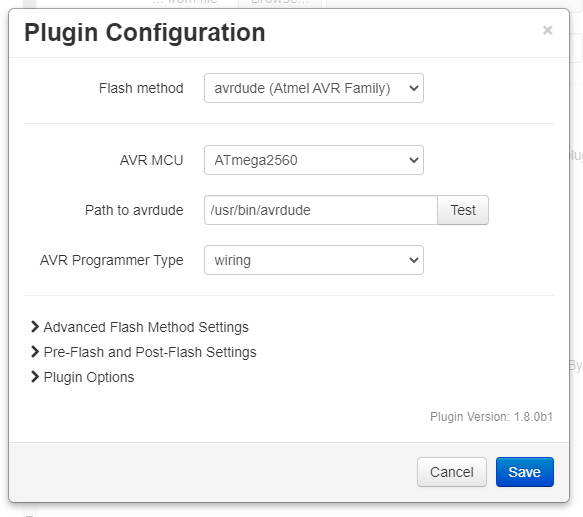

# Flashing an Atmega (AVR) Board with Avrdude

All AVR boards can be flashed using avrdude.  Many boards have a bootloader installed which allows flashing via the USB port, but some boards will required hardware such as a USBasp or other In-System-Programmer (ISP).  

You will need to know how to configure avrdude to flash your board before you can flash it with the Firmware Updater plugin.  If you do not know what settings you need you maybe able to find out from a user community or forums for your printer/board.

## Table of Contents
1. [Avrdude Installation](#avrdude-installation)
   1. [Raspberry Pi](#raspberry-pi)
   1. [Ubuntu Linux](#ubuntu-linux)
1. [Avrdude Configuration](#avrdude-configuration)
   1. [Required Settings](#required-settings)
   1. [Optional Settings](#optional-settings)
1. [Hardware Notes](#hardware-notes)
   1. [Creality Ender](#creality-ender)
   1. [Prusa MMU and CW1](#prusa-mmu-and-cw1)

## Avrdude Installation
To flash an ATmega-based board the tool `avrdude` needs to be installed on the OctoPrint host.

### Raspberry Pi

```
sudo apt-get update
sudo apt-get install avrdude
```

### Ubuntu Linux
Information about the package needed can be found here [Ubuntu avrdude package](https://launchpad.net/ubuntu/+source/avrdude)

```
sudo add-apt-repository ppa:pmjdebruijn/avrdude-release
sudo apt-get update
sudo apt-get install avrdude
```

## Avrdude Configuration
<p align="center">
  
</p>

### Required Settings
The minimum settings needed are:
* AVR MCU Type
* Path to avrdude
* AVR Programmer Type

Typical MCU/programmer combinations are:

| AVR MCU | Programmer | Example Board |
| --- | --- | --- |
| Atmega1284p | arduino | Anet A series, most Creality boards, Ender, etc. |
| Atmega2560 | wiring | Creality CR-10 Max, RAMPS, RAMbo, etc. |
| Atmega644p | arduino | Sanguinololu, Melzi |
| Atmega32u4 | avr109 | Prusa MMU, Prusa CW1 |

To locate `avrdude` on most Linux variants (including OctoPi):
* Connect via SSH and run the following: `which avrdude`
* The output should be similar to:
   ```
   pi@octopi:~ $ which avrdude
   /usr/bin/avrdude
   pi@octopi:~ $
   ```
* Add the full path to avrdude in the plugin settings.

### Optional Settings
| Option | Description |
| --- | --- |
| avrdude Baud Rate| Speed for communication with the board.  'Default' is strongly recommended. |
| avrdude config file | Can be used to override the default config file with a custom one. |
| Disable write verification | Speed up flashing by not verifying the write operation.  Not recommended! |
| Command line | Customize the avrdude command line, e.g. to specify an MCU or programmer which is not listed. |
| Disabling bootloader warning | Disables a warning which is shown the hex filename has 'bootloader' in it. |

## Hardware Notes
### Creality Ender
The Atmega-based mainboard in the Ender 3 (and probably other devices) is supplied without a bootloader.  The first time you want to upgrade its firmware you have to use extra programming hardware (a USBasp) to install a bootloader.  Alternately you can use the "USB ISP" programmer which they include with their [BL-Touch Add-on Kit](https://www.creality3dofficial.com/products/creality-bl-touch?_pos=8&_sid=07be62867&_ss=rell), which comes with a pinout card.

### Prusa MMU and CW1
Original firmware files for Prusa MMU and CW1 have special in the begining of the file:

For MMU these are:

```
1 ;device = mm-control   
2 
```

and for CW1:

```
1 ;device = cw1   
2 
```

The Firmware Updater plugin will automatically detect these headers and handle the files accordingly.
