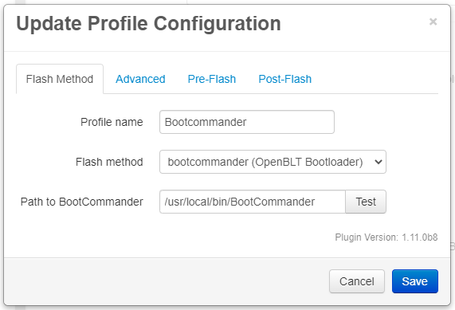

# Flashing a board with BootCommander

Boards running the OpenBLT bootloader can be flashed using BootCommander.

## Table of Contents
1. [BootCommander Installation](#bootcommander-installation)
1. [BootCommander Configuration](#bootcommander-configuration)
   1. [Required Settings](#required-settings)
   1. [Optional Settings](#optional-settings)

## BootCommander Installation
To flash an OpenBLT-based board the tool `BootCommander` needs to be installed on the OctoPrint host.

BootCommander and its dependency LibOpenBLT must be compiled and installed from source. 

Full instructions are [here](https://www.feaser.com/openblt/doku.php?id=manual:bootcommander).

## BootCommander Configuration

  

### Required Settings
The only required setting is the path to the BootCommander binary.

### Optional Settings
| Option | Description |
| --- | --- |
| Reset before flashing | Send an `M997` command to the board to initiate a reset and activate the bootloader prior to running BootCommander. Needed if the firmware is not 'OpenBLT aware'. |
| Command timeout | The length of time that the plugin will wait for the bootloader to be detected. Default is 30s. |
| BootCommander Baud Rate | The baud rate BootCommander will use when communicating with the bootloader. Default is 57600. |
| Command line | The command used to flash the firmware to the board. |
