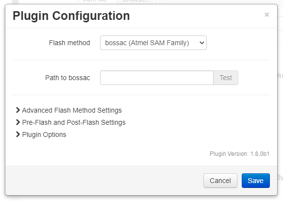

# Flashing a SAM board with Bossac

<p align="center">
  
</p>

To flash a SAM-based board the tool `bossac` needs to be installed on the OctoPrint host.

## Bossac Installation
Bossac cannot be installed using a package manager as the packaged version is out of date and will not work.  Installation from source is straight-forward.

```
cd ~/
sudo apt-get install libwxgtk3.0-dev libreadline-dev
wget https://github.com/shumatech/BOSSA/archive/1.7.0.zip
unzip 1.7.0.zip
cd BOSSA-1.7.0
./arduino/make_package.sh
sudo cp ~/BOSSA-1.7.0/bin/bossac /usr/local/bin/
```

## Bossac Configuration
The only required setting is the path to the bossac binary.

Optional advanced settings are available for:
* Disabling write verification - speeds up flashing by not verifying the write operation
* Customizing the bossac command line
