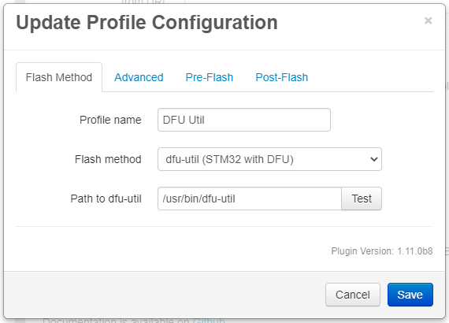

# Flashing an STM32 board with dfu-util

MKS Rumba 32 boards, and other STM32 boards with DFU mode, can be flashed with dfu-util.

## Table of Contents
1. [Dfu-util Installation](#dfu-util-installation)
   1. [Linux (including Raspberry Pi)](#linux-including-raspberry-pi)
1. [Bossac Configuration](#bossac-configuration)
   1. [Required Settings](#required-settings)
   1. [Optional Settings](#optional-settings)

## Dfu-util Installation
To flash a STM32-based DFU-mode board the tool `dfu-util` needs to be installed on the OctoPrint host.

### Linux (includng Raspberry Pi)
Dfu-util can be installed on most systems using the package manager

```
sudo apt update
sudo apt install dfu-util
```

Locate the dfu-util binary using `which`:

```
pi@octopi:~ $ which dfu-util
/usr/bin/dfu-util
pi@octopi:~ $
```

## Dfu-util Configuration
<p align="center">
  
</p>

### Required Settings
The only required setting is the path to the dfu-util binary.

### Optional Settings
| Option | Description |
| --- | --- |
| Flash command line | The command used to flash the firmware to the board. |
