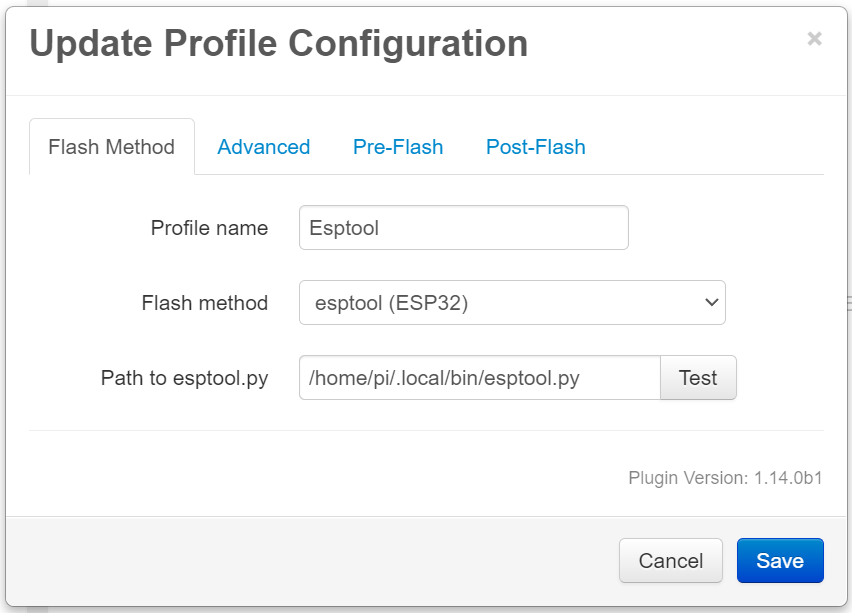

# Flashing an ESP32 Board wth esptool.py

This method applies to ESP32-based boards which can be updated using esptool.py.

## Table of Contents
1. [Esptool Installation](#esptool-installation)
1. [Esptool Configuration](#stm32flash-configuration)
   1. [Required Settings](#required-settings)
   1. [Optional Settings](#optional-settings)

## Esptool Installation
To flash an ESP32-based board using esptool, the tool needs to be installed on the OctoPrint host.

Installation instructions can be found in the Espressif documentation:
https://docs.espressif.com/projects/esptool/en/latest/esp32/installation.html

Esptool can be installed in the OctoPrint virtual environment, if one is being used, or in the host's native Python environment.

## Esptool Configuration

  

### Required Settings
The only required setting is the path to esptool.py.

### Optional Settings
| Option | Description |
| --- | --- |
| Chip Type | Can be used to override the ESP chip type. Default is `auto`. |
| Baud Rate | Specify the baud rate for esptool to use when writing to the board. Default is `921600`. |
| Flash Address | The address in hex to write the firmware to. Default is `0x10000`. |
| Command Line | Allows full customization of the `esptool.py` command line. |
