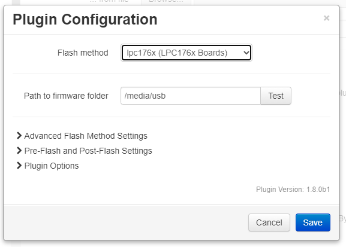

# Flashing a Board from the SD Card

This method applies to LPC1768 and LPC1769 boards, and other boards which are flashed by copying a file named `firmware.bin` to the SD card and resetting the board.  This includes some STM32 boards which have the required bootloader installed (e.g., SKR Pro v1.1, SKR Mini E3 v2).

Flashing a board from the SD requires that the host can mount the board's on-board SD card to a known mount point in the host filesystem.  If your firmware does not expose the SD card to the host, and cannot be configured to do so, *this method will not work*.

## Table of Contents
1. [Marlin Firmware Configuration](#marlin-firmware-configuration)
1. [SD Card Mounting](#sd-card-mounting)
   1. [Usbmount](#usbmount)
      1. [Install Usbmount](#install-usbmount)
      1. [Configure Usbmount](#configure-usbmount)
      1. [Configure systemd-udevd](#configure-systemd-udevd)
      1. [File System Permissions](#file-system-permissions)
   1. [Sudo Rights](#sudo-rights)
      1. [Configure sudo](#configure-sudo)
1. [lpc176x Configuration]
1. [Troubleshooting](#troubleshooting)
   1. [Board Reset Failed](#board-reset-failed)
   1. [SD Card Mounting](#sd-card-mounting)

## Marlin Firmware Configuration
The following options should be enabled in the Marlin firmware configuration in order for the board's SD card to be accessible by the OctoPrint host:

Configuration.h:
```
#define SDSUPPORT
```

Configuration_adv.h:
```
#define SDCARD_CONNECTION ONBOARD
```

Optionally, if you do not routinely use the SD card in Marlin, you can prevent Marlin mounting the card at startup, which will make firmware flashing faster as the firmware's lock on the card does not have to be released.

Configuration_adv.h:
```
#define SD_IGNORE_AT_STARTUP 
```

## SD Card Mounting
There are several ways to have the SD card mounted by the host.  Depending on your level of experience and knowledge with Linux you are free to use whatever method you prefer.

For new users, using [usbmount](https://github.com/rbrito/usbmount) is recommended and is documented below.  When properly installed and configured it will automatically mount the board's SD card to `/media/usb`.

### Usbmount
Usbmount needs to be installed and configured to make it work.  The instructions below assume that you are running OctoPrint on a Raspberry Pi as the user `pi`.

#### Install usbmount
Usbmount can be installed using the package manager.  Run this command in an SSH prompt on your OctoPrint host:

   `sudo apt-get install usbmount`

#### Configure usbmount
Usbmount must be configured so that the mounted device has the correct permissions for the 'pi' user to access the SD card.

1. Run this command in an SSH prompt on your OctoPrint host:

   `sudo nano /etc/usbmount/usbmount.conf`

1. Find the `FS_MOUNTOPTIONS` line and change it to:
   
   `FS_MOUNTOPTIONS="-fstype=vfat,gid=pi,uid=pi,dmask=0022,fmask=0111"`

#### Configure systemd-udevd
systemd-udevd must be configured so that the mount is accessible.

1. Run this command in an SSH prompt on your OctoPrint host:

   `sudo systemctl edit systemd-udevd`
   
1. Insert these lines then save and close the file:
   ```
   [Service]
   PrivateMounts=no
   MountFlags=shared
   ```

1. Run the following commands in an SSH prompt on your OctoPrint host:
   ```
   sudo systemctl daemon-reload
   sudo service systemd-udevd --full-restart
   ```

Once usbmount is installed and configured the on-board SD card should be mounted at `/media/usb` the next time it is plugged in or restarted.

#### File System Permissions

**Important:** Do not modify the permissions on any of the /media/usb* directories!

See [here](https://github.com/OctoPrint/OctoPrint-FirmwareUpdater/issues/175#issuecomment-760949800) and [here](https://github.com/OctoPrint/OctoPrint-FirmwareUpdater/issues/175#issuecomment-761111117) for the explanation of why this is important and a very bad idea.

### Sudo rights
The plugin needs to be able to unmount the SD card to reduce the risk of file system corruption.  The default command the plugin will use is `sudo umount /media/usb`.  You must be able to run this command at the command line without being prompted for a password.

If your system is configured to allow `pi` to run all `sudo` commands without a password (the default) then you do not need to do anything further.

Alternatively, you can disable the unmount command entirely by clearing the **Unmount command** field in the plugin's advanced settings, however this is not recommended.

#### Configure Sudo
If you need to enter a password when running `sudo` commands as `pi` you will need to create a new `sudoers` entry in order for the plugin to work correctly.

1. Run this command in an SSH prompt on your OctoPrint host to create a new sudo rule file:

   `sudo nano /etc/sudoers.d/020_firmware_updater`
   
2. Paste this line into the new file:

   `pi ALL=NOPASSWD: /bin/umount`
   
3. Save and close the file

## LPC176x Configuration
<p align="center">
  
</p>

### Required Settings
The only required setting is the path to the firmware update folder.  If using usbmount it will be `/media/usb`.

### Optional Settings
Optional advanced settings are available for:
* Resetting the board prior to flashing - adds an extra board reset which can help ensure that the SD card is mounted correctly
* Configuring the unmount command - clear the command line to disable it

## Troubleshooting
### Board reset failed
The `M997` command is used to reset the board.  If flashing an existing Marlin installation, the existing firmware must be newer than March 2nd, 2019 (i.e [this commit](https://github.com/MarlinFirmware/Marlin/pull/13281)) as that is when the `M997` was added to support resetting the board.

A board running too-old Marlin firmware will report 'Board reset failed' when attempting to flash from the plugin.

### SD Card Mounting
The firmware upload will fail if the SD card is not accessible, either because it is not mounted on the host, or because the printer firmware has control over it.

The most common causes are:
* Firmware not correctly configured to expose SD card to host via USB - reconfigure the firmware
* Firmware is using the SD card so it is not available to the host - release the firmware's hold on the card with the `M22` command
* usbmount is not configured correctly - follow the instructions to install and configure usbmount
