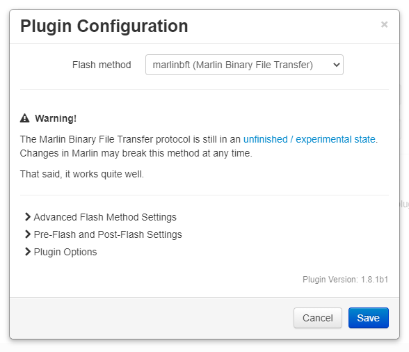

# Flashing an LPC176x or STM32 board using Binary File Transfer

Binary File ransfer is an alternative method to transfer the `firmware.bin` file to a printer that can be flashed from the SD card.

**WARNING:** This feature is based on the experimental Marlin [Binary File Transfer Protocol](https://github.com/MarlinFirmware/Marlin/pull/14817).  It works well, but the protocol will undergo changes before it goes final, which **will** break it.  When that happens I will update the plugin, but it may not happen immediately.

## Table of Contents
1. [Warnings and Caveats](#warnings-and-caveats)
1. [Installation](#installation)
   1. [Marlin Binary Protocol Package](#marlin-binary-protocol-package)
1. [Marlin Configuration](#marlin-configuration)
1. [Plugin Configuration](#plugin-configuration)
   1. [Required Settings](#required-settings)
   1. [Optional Settings](#optional-settings)

## Warnings and Caveats
1. **The binary file transfer protocol is still work in progress**

   While the current implementation works, it **will** change, and these changes **will** break the current version.  As much as possible, I will try to support the current implementation and the final version, but my ability to do so may be limited due to dependencies on other libraries.  

   If it comes to a choice, the final version will be the one which is supported.

1. **Your Raspberry Pi may crash, but it's not my fault**

   While developing this I came across what seems to be a [bug in the Raspberry Pi kernel](https://github.com/raspberrypi/linux/issues/4120), where it will sometimes panic (crash) when the printer board resets.  To mitigate this, as of Feb 6th 2021, a 2s delay [has been added](https://github.com/MarlinFirmware/Marlin/commit/004bed8a7fc3ff9feb73a0ea9794635b50073c27) to the LPC `M997` reset routine which appears to stop the crash from happening.  You will need to be running Marlin from the `bugfix-2.0.x` branch, after https://github.com/MarlinFirmware/Marlin/commit/004bed8a7fc3ff9feb73a0ea9794635b50073c27 to have the fix.

   On my test system, with the old reset code, I would easily crash my Pi anywhere between 1-25 resets.  After the change I have flashed the board dozens of times and reset it 500+ times without crashing it.

   That said, the underlying bug still exists, so you may still experience your Pi crashing when the board resets.  Caveat emptor.
   
## Installation
### Marlin Binary Protocol Package
The plugin currently uses the `marlin-binary-protocol` package to implement the transfer protocol.  This package has dependencies on `heatshrink`, which is hard to install automatically due to compatibility issues with Python 2 and Python 3.  For this reason the marlin-binary-protocol package and the heatshrink dependency need to be installed manually using `pip`.

NB: If you are running OctoPrint in a VirtualEnv (as recommended) you need to run the appropriate `pip` commands below inside that environment. For **OctoPi** users, this is `~/oprint/bin/pip` anywhere it says `pip` or `pip3`.

Depending on your system, the command you use to restart OctoPrint may also be different.

#### Python 2
1. Install `marlin-binary-protocol` - the dependencies just work

    `pip install marlin-binary-protocol`
1. Restart OctoPrint

   `sudo service octoprint restart`
   
#### Python 3
1. Install a Python 3 compatible version of `heatshrink` to satisfy `marlin-binary-protocol`

    `pip3 install https://github.com/p3p/pyheatshrink/releases/download/0.3.3/pyheatshrink-pip.zip`
1. Install `marlin-binary-protocol`

    `pip3 install marlin-binary-protocol`
1. Restart OctoPrint

   `sudo service octoprint restart`
   
## Marlin Configuration
### Enable the Binary File Transfer protocol
Your printer must have the binary file protocol enabled in order to be able to use the protocol to copy firmware files to your printer.

In other words, before you can use the Firmware Updater plugin, you must compile firmware with this feature enabled and flash it to your printer using your current update process.  You only need to do this once.

To compile firmware with the binary file protocol enabled, uncomment this line in `Configuration_adv.h`:

`#define BINARY_FILE_TRANSFER`

You can verify that the protocol is enabled using the `M115` command to get a capability report.  The report must include this line:
```
Recv: Cap:BINARY_FILE_TRANSFER:1
```
If the value is `0` then the feature has not been enabled and the plugin will not work.

### Set the SD card connection to ONBOARD
The SD card connection must be configured for `ONBOARD`.  If it is set to `LCD` the firmware file will be copied to the SD card in the LCD and the board will not update when it is reset.

To set the SD card to `ONBOARD`, modify the `#define SDCARD_CONNECTION` line in `Configuration.h`:

`#define SDCARD_CONNECTION ONBOARD`

## Prerequisite Check
When both prerequisites are satisfied, the `~/.octoprint/logs/octoprint.log` file will contain lines like these shortly after OctoPrint is started and the ptiner is connected:
```
2021-03-06 09:24:58,000 - octoprint.plugins.firmwareupdater - INFO - Python binproto2 package installed: True
2021-03-06 09:45:10,815 - octoprint.plugins.firmwareupdater - INFO - Setting BINARY_FILE_TRANSFER capability to True
```

## Plugin Configuration
<p align="center">
  
</p>

### Required Settings
There are no required settings.

### Optional Settings
| Option | Description |
| --- | --- |
| Wait after connect | Some boards reset after getting the command to start binary transfer mode. A value of 3 seconds is normal for when this wait is required. Default is 0. |
| Communication timeout | Protocol communication timeout. Default is 1000ms. |
| Verbose progress logging | Log verbose transfer progress to the OctoPrint log file |
