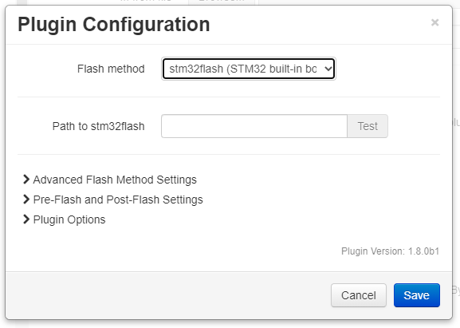

# Flashing an STM32 Board wth STM32Flash

This method applies to the FYSETC Cheetah and other STM32-based boards which are updated using stm32flash.

**Note:** STM32-based boards which can be updated from the SD card (e.g., SKR Pro v1.1, SKR Mini E3 v2) should use the [lpc176x flash method](lpc176x.md).  This method described on this page is only for boards which are updated using stm32flash.

## Table of Contents
1. [STM32Flash Installation](#stm32flash-installation)
   1. [Linux (Including Raspberry Pi)](#linux-including-raspberry-pi)
   1. [macOS](#macos)
   1. [Windows](#windows)
1. [Stm32flash Configuration](#stm32flash-configuration)
   1. [Required Settings](#required-settings)
   1. [Optional Settings](#optional-settings)

## STM32Flash Installation
To flash an STM32-based board using stm32flash, the tool needs to be installed on the OctoPrint host.

### Linux (Including Raspberry Pi)

```
sudo apt-get update
sudo apt-get install stm32flash
```

### macOS
[Brew](https://brew.sh/) is used to install stm32flash on macOS.

```
brew install stm32flash
```

### Windows
You can install a Windows binary from https://sourceforge.net/projects/stm32flash/ however the plugin hasn't been tested on that platform.

## STM32Flash Configuration
<p align="center">
  
</p>

### Required Settings
The only required setting is the path to the stm32flash binary.

### Optional Settings
| Option | Description |
| --- | --- |
| Verify while writing | By default write verification is done during the write process; uncheck this box to disable it.  It is strongly recommended to keep it enabled. |
| BOOT0 and Reset pins | When using ST serial bootloader the boards needs to enter bootloader mode by setting the MCU `BOOT0 ` to HIGH and then setting MCU `RESET` to LOW. Such MCU inputs are generally connected to RTS/DTR signals of the USB-UART transceiver.  For example, FYSETC Cheetah uses RTS to set BOOT0, and DTR to reset.  Please set STM32Flash BOOT0/Reset according to your board.|
| Start Execution Address | Unlike other MCUs, STM32s will remain in bootloader mode after resetting DTR line and realeasing UART. The bootloader needs an explicit command to jump at a given flash address.  Set the Execution address according to your board. |
| Reset after flashing | When setting Execution address the reset option is ignored by stm32flash.  Setting Reset instead of Execution address will actually send an `Execute @ 0x00000000`, which is where the bootloader is located.  You will then need to power cycle your board to execute firmware.  **Enabling this option is not recommended.** |
